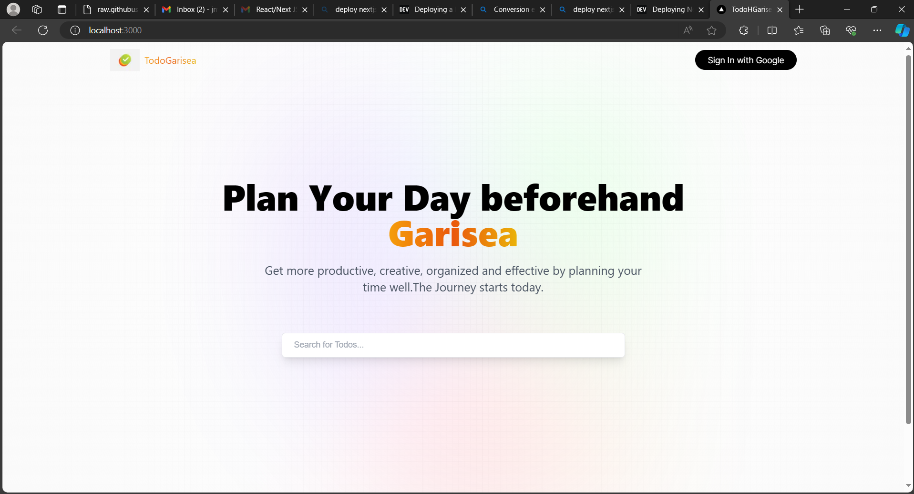
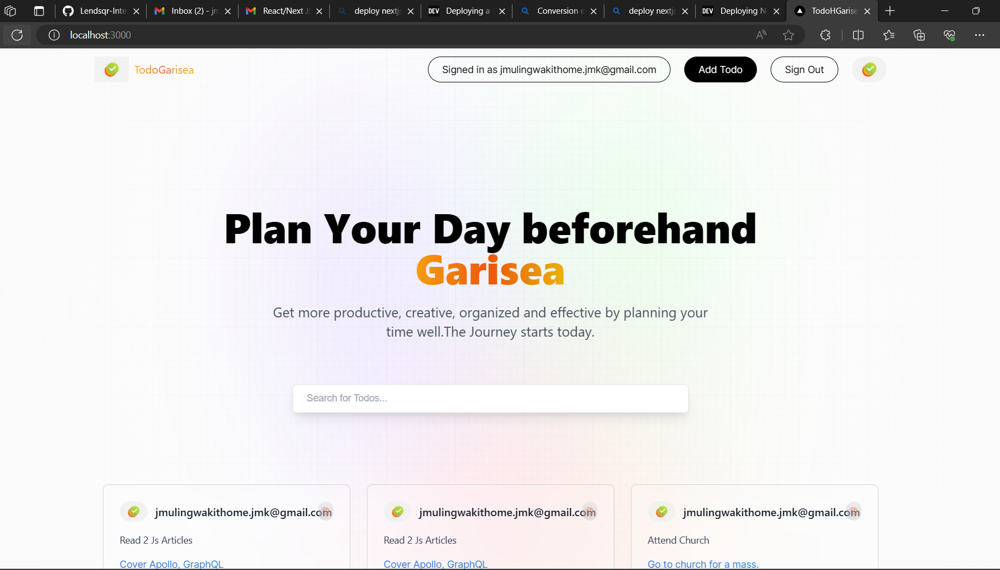

# Garisea - ToDo List Web App

Hey there! 👋 I'm excited to share my solution to the Garisea code challenge. Garisea is a full-stack ToDo list web application built with NextJS, Redux, and GraphQL. 
This project was a fantastic opportunity to showcase my skills in frontend/API/backend development, engineering standards, modular component architecture, test-driven development, and UI design/development.

# Challenge Highlights

I successfully implemented the following features in the Garisea app:

- Added new todos to the list
- Marked todos as complete
- Deleted todos from the list
- Implemented filtering by all/active/complete todos
- Added functionality to clear all completed todos
- Ensured a responsive design for optimal user experience on various devices
- Bonus: Implemented drag and drop to reorder items on the list

 #Tools used
 - NextJs 13
 - Mongodb
 - Tailwind
 - Next-auth


### Technical Details

To meet the technical requirements:

- I used a MongoDB for data storage, calling data through a GraphQL API.
- Implemented user management and authentication, allowing only logged-in users to manage the todo list.
- Leveraged Redux and component states to manage CRUD tasks.
- Named the application "Garisea."

## Getting Started

To check out my solution:

1. Clone the private GitHub repository:

   ```bash
   git clone https://github.com/JosephKithome/TodoGarisea.git
   ```

2. Install dependencies:

   ```bash
   npm install
   ```

3. Start the development server:

   ```bash
   npm run dev
   ```

# Sample Screenshots




## Feedback and Contributions

I'm open to feedback and contributions! If you have any suggestions or encounter issues, please let me know by opening an issue on the [GitHub Issues](https://github.com/your-username/garisea/issues) page.

## License

This project is licensed under the [MIT License](LICENSE.md).

## Contact

For any further inquiries, feel free to reach out to me, josephkithome.jmk@gmail.com

Thanks for considering my submission to the Garisea challenge! 🚀


